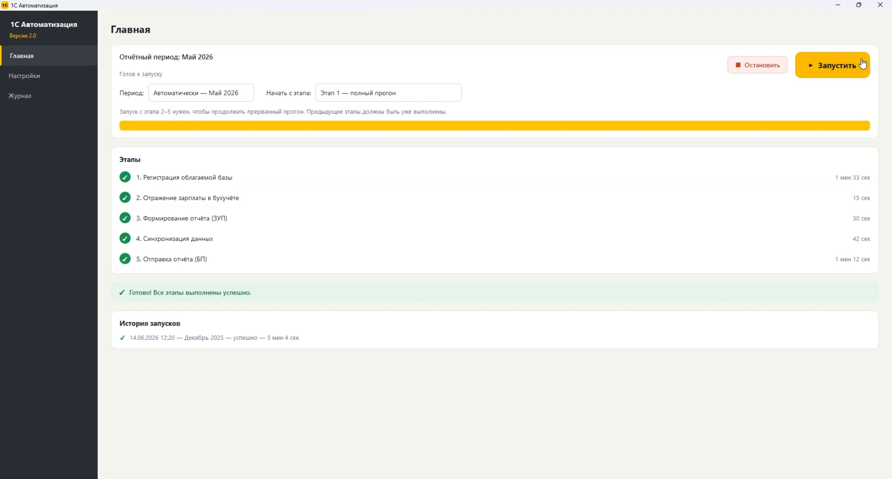
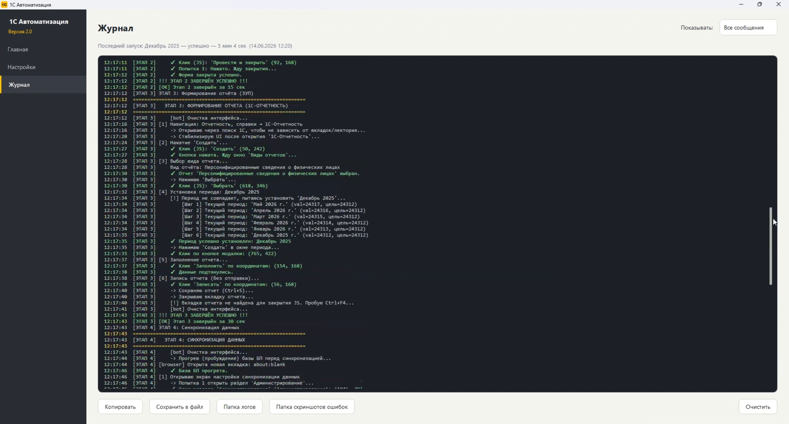
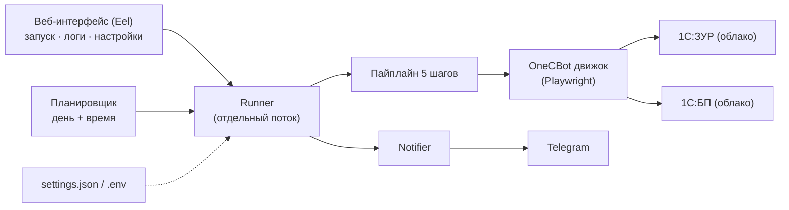

# 1C Reporting Automation · Автоматизация отчётности 1С

Десктоп-приложение (Windows), которое автоматически выполняет ежемесячный цикл сдачи зарплатной отчётности в облачных **1С:ЗУП** и **1С:Бухгалтерия** — по расписанию и с уведомлениями в Telegram.

  -7952B3)  

> 🔒 **Закрытый проект.** Архитектура, решения и результаты. Исходный код приватный — готов показать по запросу (доступ к приватному репозиторию или live-демо на созвоне).

---

## Проблема

Каждый месяц бухгалтер вручную прогоняет одну и ту же длинную цепочку действий в двух облачных базах 1С: зарегистрировать облагаемую базу, отразить зарплату в бухучёте, сформировать персонифицированные сведения, синхронизировать данные и отправить регламентированный отчёт. Это десятки кликов в капризном веб-интерфейсе 1С, легко ошибиться или забыть про срок, и всё завязано на конкретного человека.

Задача: убрать ручную рутину — один запуск (или по расписанию) делает весь цикл сам.

## Что делает

Приложение проходит полный месячный цикл из **5 шагов**, не закрывая браузер между ними:

1. **Регистрация облагаемой базы** (ЗУП)
2. **Отражение зарплаты в бухучёте** (ЗУП)
3. **Формирование отчёта 1С-Отчётность** — персонифицированные сведения (ЗУП)
4. **Синхронизация данных** ЗУП → БП (с «прогревом» спящей облачной базы)
5. **Отправка регламентированного отчёта** в Бухгалтерии (БП)

Дополнительно:

- 🖥️ **Веб-интерфейс** (Eel): запуск, живые логи в реальном времени, страница настроек.
- ⏰ **Запуск по расписанию** — заданный день месяца и время, без участия человека.
- 🔔 **Telegram-уведомления** об успехе/ошибке + скриншот места ошибки.
- 🪟 **Трей и автозапуск Windows**, сборка в один `.exe` (PyInstaller) — клиент просто запускает приложение.

## Демо · Screenshots

| Интерфейс | Логи в реальном времени |
|---|---|
|  |  |

## Архитектура

Подробно — в [`docs/ARCHITECTURE.md`](docs/ARCHITECTURE.md). Кратко:



## Стек

**Python 3.12** · **Playwright** (браузерная автоматизация) · **Eel** (веб-UI) · **customtkinter** · **pystray** (трей) · **PyInstaller** (сборка в `.exe`) · **requests** · **Telegram Bot API**.

## Инженерные решения

Несколько вещей, которыми я доволен (фрагменты ниже — **упрощённые**, для иллюстрации подхода).

### 1. Фоновый «киллер» попапов 1С

Веб-клиент 1С постоянно выкидывает модальные окна («Документ проведён», «Не показывать снова» и т.п.), которые ломают сценарий. Вместо ручного закрытия в каждом шаге — фоновый JS-интервал в странице, который сам гасит шум, пока работает автоматизация.

```python
_POPUP_KILLER_JS = """
() => {
    if (window.__killerOn) return;
    window.__killerOn = true;
    setInterval(() => {
        for (const el of document.querySelectorAll('button, span, a')) {
            const t = (el.innerText || '').trim().toLowerCase();
            if (t === 'ок' || t === 'закрыть' || t.includes('не показывать')) {
                el.click();
            }
        }
    }, 500);
}
"""

def start_popup_killer(page):
    page.evaluate(_POPUP_KILLER_JS)  # запускается один раз на страницу
```

### 2. Умное ожидание готовности страницы вместо жёстких пауз

`sleep(5)` — это либо медленно, либо нестабильно. Вместо этого ждём, пока исчезнет оверлей загрузки 1С, а затем — короткого «затишья» DOM (с потолком по времени, чтобы анимации не подвешивали сценарий).

```python
def wait_until_ready(page, settle_ms=400, cap_ms=15000):
    page.wait_for_function(
        """(cap) => {
            const overlay = document.querySelector('.webProgressOverlay');
            const busy = overlay && getComputedStyle(overlay).display !== 'none';
            return !busy;  // оверлей загрузки исчез
        }""",
        arg=cap_ms, timeout=cap_ms,
    )
    page.wait_for_timeout(settle_ms)  # короткое затишье DOM
```

### 3. Скриншот + Telegram при ошибке

Клиент не сидит в логах. Если шаг падает — автоматически делается скриншот места ошибки и уходит в Telegram, так что результат виден, не открывая приложение.

```python
def run_step(num, name, func):
    try:
        func()
        notify(f"✅ Шаг {num}. {name} — готово")
    except Exception as e:
        shot = capture_screenshot(f"errors/step{num}.png")
        notify(f"❌ Шаг {num}. {name} — ошибка: {e}", screenshot=shot)
        raise
```

### 4. Отчётный период «как в 1С»

Маленькая, но важная деталь: период считается сам (предыдущий месяц), а даты и название месяца форматируются ровно так, как их ждут поля 1С.

```python
def get_report_month():
    now = datetime.now()
    return (12, now.year - 1) if now.month == 1 else (now.month - 1, now.year)
# -> "Апрель 2026", дата документа "30.04.2026"
```

## Результат

- Ручное выполнение процесса занимало примерно **20–30 минут на каждого сотрудника**.
- После первоначальной настройки пользователь запускает весь цикл одной кнопкой или задаёт расписание для автоматического выполнения.
- Приложение не устанавливает фиксированного ограничения на количество сотрудников: объём обработки можно увеличивать без изменения основного сценария.
- По фактической оценке автоматизация выполнила уже **более 300 рабочих запусков**.
- Все пять этапов проходят последовательно без необходимости постоянно контролировать процесс.
- После завершения пользователь получает результат в Telegram, а при ошибке — уведомление и скриншот проблемного места.

Экономия времени растёт вместе с количеством сотрудников: вместо повторения одних и тех же действий для каждого человека пользователь один раз настраивает приложение и запускает общий автоматизированный процесс.

## Ограничения и развитие

- Завязано на текущую вёрстку веб-клиента 1С — при обновлении интерфейса 1С локаторы требуют поддержки.
- Только Windows (автозапуск через реестр, сборка в `.exe`).
- Настройки и секреты хранятся локально (`settings.json` / `.env`), заполняются через интерфейс.

## Доступ к коду

Репозиторий с исходниками приватный. Покажу по запросу: выдам доступ к приватному репозиторию или проведу live-демо. Напишите — [Telegram](https://t.me/baylov93) · aimbaylov@gmail.com

---

© 2026 Ilya Baylov. Проприетарный проект. Этот репозиторий содержит только документацию кейса.
