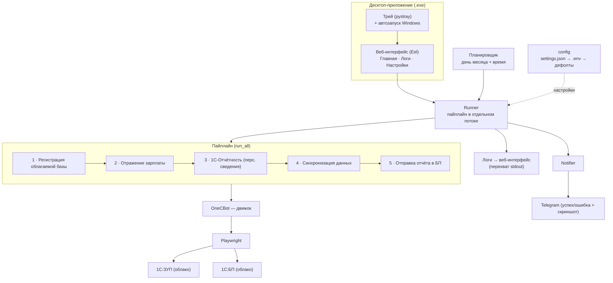
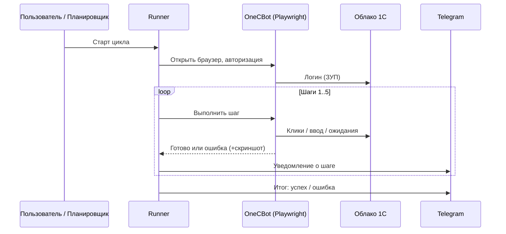

# Архитектура · Architecture

Приложение — это десктопный «обёртка-оркестратор» вокруг браузерной автоматизации 1С. Пользователь работает через локальный веб-интерфейс, а вся логика выполняется в отдельном потоке, управляя реальным браузером через Playwright.

## Поток данных

## Жизненный цикл запуска

## Карта модулей

| Слой | Назначение |
|---|---|
| **app** | Точка входа десктоп-приложения: Eel-сервер, трей, автозапуск, перехват `print()` → живые логи в UI. |
| **web/** | Фронтенд интерфейса (HTML/CSS/JS): Главная, Логи, Настройки. |
| **runner** | Запуск пайплайна в отдельном потоке, перенаправление вывода, контроль остановки. |
| **run_all** | Оркестрация 5 шагов: один браузер на весь цикл, callbacks прогресса, переход ЗУП → БП. |
| **step1…step5** | Бизнес-логика каждого этапа отчётности. |
| **one_c_engine** | Универсальный движок 1С: фоновый киллер попапов, длительные клики по координатам, умные ожидания, обход iframe, скриншоты ошибок. |
| **auth / browser** | Авторизация в 1С и управление контекстом браузера Playwright. |
| **locators / utils** | Селекторы элементов 1С и вспомогательные функции (поиск активной вкладки, закрытие шума). |
| **date_utils** | Расчёт отчётного периода и форматирование дат «как в 1С». |
| **notifier** | Telegram-уведомления: тест, успех, ошибка + скриншот. |
| **config / settings_manager** | Настройки с приоритетом `settings.json` → `.env` → дефолты. |

## Принципы устойчивости

- **Фоновый киллер попапов** вместо ручного закрытия модалок в каждом шаге.
- **Умные ожидания** (исчезновение оверлея + затишье DOM) вместо `sleep`.
- **Прогрев спящей облачной базы** перед синхронизацией, чтобы не ловить таймаут.
- **Скриншот при любой ошибке** + уведомление, чтобы диагностировать удалённо.
- **Рекурсивный обход iframe** — элементы 1С часто лежат во вложенных фреймах.
